> 从2024-6-6下午开始，学习黑马程序员的Java

# 快捷键及快捷命令

## 快捷键

1、`ctrl + art l`快速格式化代码

2、`ctrl + alt + v`可以快速为带有返回值的方法名提供变量用于接受	

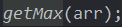`ctrl + alt + v`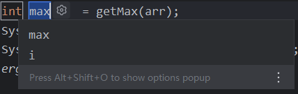

3、`ctrl + p`在函数传参的时候，如果不知道该传入什么参数，可以使用该快捷键

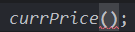`ctrl + p`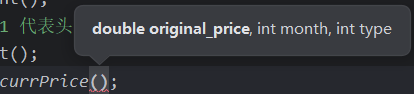

4、`ctrl + alt + m`快捷抽取方法

5、`shift + f6`快速重命名

6、`alt + insert` 快速生成构造函数和getxxx(()、setxxx()方法，可以指定参数，也可以`ctrl + a`全选

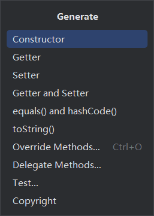**构造函数**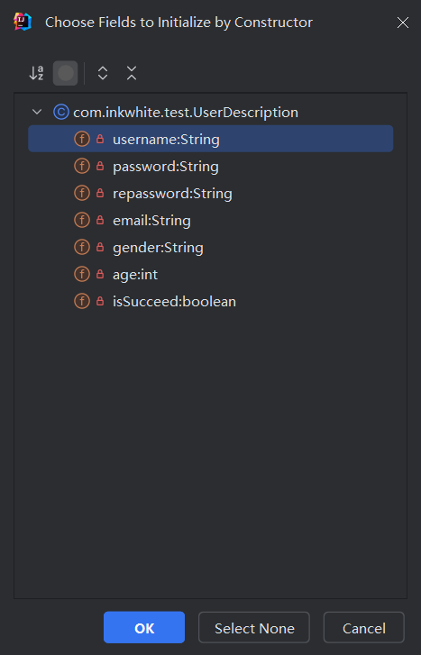

**Getter and Setter**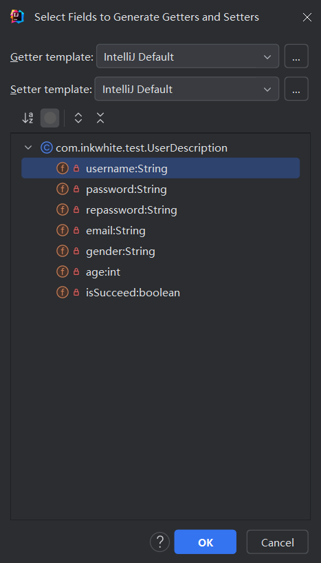


## 快捷命令

1、使用`psvm`可以快捷输入👇

`public static void main(String[] args) {}`

2、使用`sout`可以快捷输入👇

`System.out.println();`

3、使用`100.fori`可以快捷输入👇

`for (int i = 0; i <= 100; i++) {}`

4、使用`数组名.fori`可以快捷输入👇

`for (int i = 0; i < 数组名.length; i++) { System.out.println(数组名[i]); }`


## other

1、关闭idea中的ai代码提示：

`Enable Full Line suggestions`

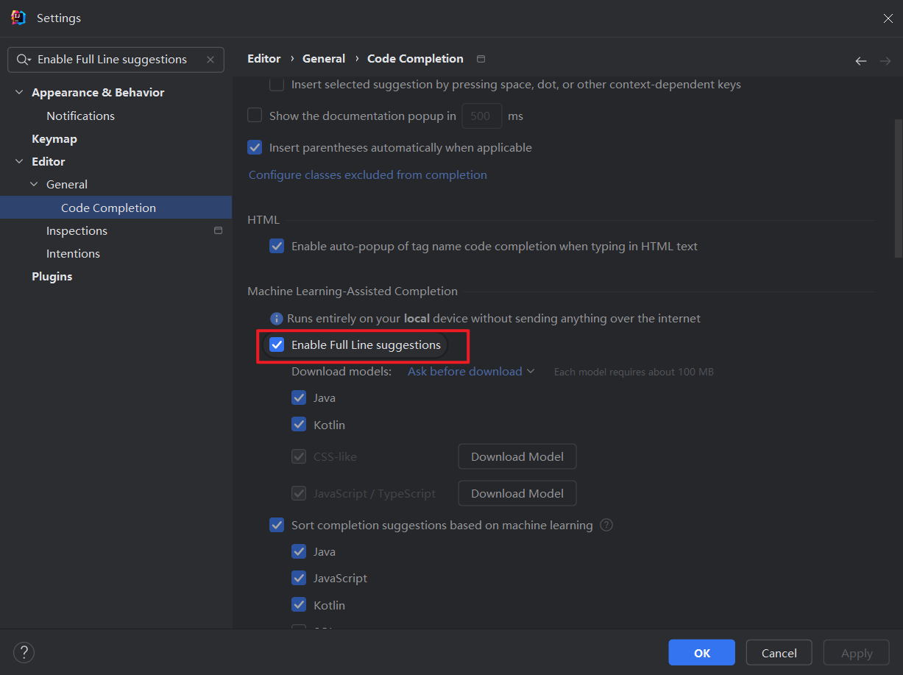

2、关于如何快速生成JavaBean

安装插件PTG

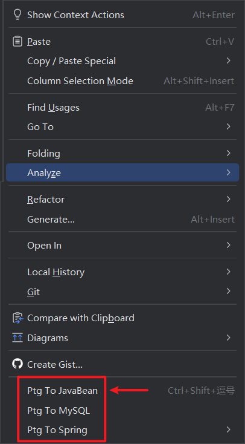


# 学习进度

## 第一天6.6

Java入门

Java基础概念


### 作业

A
B
BC——应修改为ABCD
BACD
CBDA

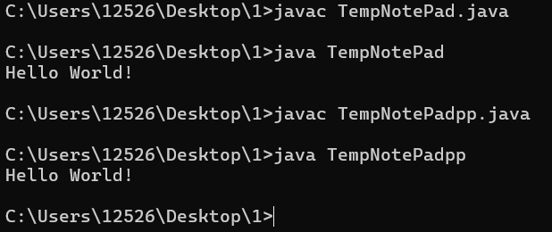


> 总结：编程语言基础部分大同小异，但是细追究的话，还是有区别的
>
> 本来是能给Java基础学完的，但是要去开实习动员会，只能放到明天了

## 第二天6.7

学习完成Java基础概念


> 总结：
>
> 今天课比较多，时间较紧，完成了数据库的大作业前的一个实训，已经9点了，再去做一下vue的大作业，马上就要进行答辩了


## 第三天6.8

学习了Java的运算符

判断和循环学了 4 集

> 总结：
>
> 在学习判断和循环的时候，对于
>
> ```java
> //老师的建议是 不要使用 == ，避免出现非判断而赋值的情况发生，但是之前在C++中是可以使用如下格式进行判断的，我在Java中试了一下，可以但是会报警告⚠️'true == a' can be simplified to 'a' ，意为可以简化为 a
> // 那么这种写法就可以在后面进行判断的时候进行实现，其实也是为了非判断而赋值 
> boolean a = false;
> if (true == a) {
> 	System.out.println(a);
> } else {
> 	System.out.println('a');
> }
> ```


## 第四天6.9

学习完成java的判断和循环

对于switch来说，JDK12加入了新特性

之前：

```java
int num = sc.nextInt();
switch(num) {
    case 1:
        System.out.println('a');
        break;
    case 2:
        System.out.println('b');
        break;
    case 3:
        System.out.println('c');
        break;  
    default:
        System.out.println('d');
}
```

JDK12之后：

```java
int num = sc.nextInt();
switch() {
    case 1 -> {
        System.out.println('a');
    }
    case 2 -> {
        System.out.println('b');
    }
    case 3 -> {
        System.out.println('c');
    }      
    default -> {
        System.out.println('d');
    }
}
```

对于新特性里面的case，如果case里面只有一行代码的话：

```java
int num = sc.nextInt();
switch() {
    case 1 -> System.out.println('a');
    case 2 -> System.out.println('b');
    case 3 -> System.out.println('c');
    default -> System.out.println('d');
}
```

对于switch有返回值的情况

```java
String curr_str = 0;
int num = sc.nextInt();
curr_str = switch() {
    case 1 -> return 'a';
    case 2 -> return 'b';
    case 3 -> return 'c';
    default -> return 'd';
}
```

`switch`和`if第三种格式`的使用场景

> `if第三种格式`：一般用于对范围的判断
>
> `switch`：把有限个数据一一列举出来，让我们任选其一

## 第五天6.13

学习完成循环高级综合练习

数组，以及方法的入门

### 随机数

生成指定范围随机数

`int num = rand.nextInt((max + 1) - min) + min`

`max + 1`:因为是包左不包右的，所以要给范围 + 1 表示包含

`(max + 1) - min`:要想使得左范围指定，那么两边必须同时加上指定区间，所以要先减

`((max + 1) - min) + min`:再加上指定范围即可

如：

```java
// 生成指定范围 3 ~ 5 的随机数
Random r = new Random();
int num = 0;
for (int i = 0; i < 10; i++) {
    num = r.nextInt((5 + 1) - 3) + 3;
    System.out.println(num);
}
```

### 地址值

对于

```java
package com.inkwhite.array;
public class demo1 {
    public static void main(String[] args) {
        int[] age_arr = new int[]{18, 19, 18, 17, 21};
        String[] name_arr = {"张三", "李四", "王五"};
        double[] height_arr = {11.1, 22.2, 33.3, 44.4};

        System.out.println(age_arr);// [I@10f87f48
        System.out.println(name_arr);// [Ljava.lang.String;@b4c966a
        System.out.println(height_arr);// [D@2f4d3709
    }
}

```

那么`[I@10f87f48`
`[Ljava.lang.String;@b4c966a`
`[D@2f4d3709`的含义是什么呢

> `[`表示数组
>
> `I、Ljava.lang.String;、D`表示数组的数据类型
>
> `10f87f48、b4c966a、2f4d3709`表示地址值

### 数组

数组默认初始化值的规律
`整数类型`：默认初始化值`0`
`小数类型`：默认初始化值`0.0`
`字符类型`：默认初始化值`'/u0000'`空格
`布尔类型`：默认初始化值`false`
`引用数据类型`：默认初始化值`null`


### 方法

小技巧

1. 我要干嘛？
2. 需要什么才能干这件事？
3. 方法的调用处，是否需要继续使用方法的结果

## 第六天6.14

学习完成方法


### 方法的内存

`基本数据类型`：变量中存储的是真实的数据

`引用数据类型`：变量中存储的是地址值

`引用`：使用了其他空间中的数据

1.方法调用的基本内存原理

2.方法传递基本数据类型的内存原理

​		传递基本数据类型时，传递的是真实的数据，形参的改变，不影响实际参数值

​        不像 `cpp`，`java` 没有`&`，只能通过 `return` 将修改的值进行返回

3.方法传递引用数据类型的内存原理

​		传递引用数据类型时，传递的是地址值，形参的改变，影响实际参数的值

## 第七天6.16

11道综合练习，对前面知识点的巩固

面向对象程序设计

### 对于封装

对象代表什么，就得封装对应的数据，并提供数据对应的行为

### 关于this

代表方法调用者的地址值

### 成员变量与局部变量的区别

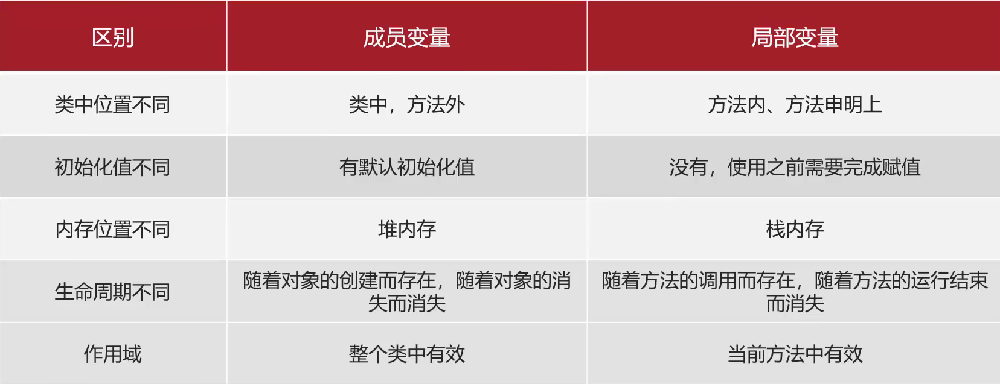


